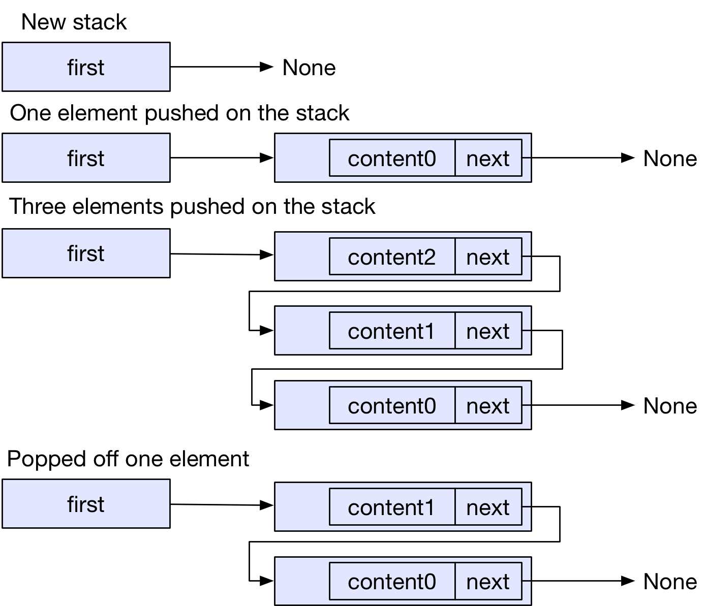

# Exercises

## Simple Stack

In this Exercise your job is to implement a very basic stack, which only accepts `i32` values as content.
For this you need the two data structures `Stack` and `StackElem`.

A `Stack` points to its first `StackElem` or nowhere if there is no element in the stack.
A `StackElem` has some content of the type `i32` and a pointer to the element following.
The `Stack` provides three methods: `new`, `push` and `pop`.

The image shows an overview of the operations.
It also gives you an idea of the fields in `Stack` and `StackElem`

- To create a new Stack construct and return a Stack that doesn't point anywhere
- You have to consider that `StackElem`s may point to another `StackElem` 
- To push an element on the stack the value in Stack itself needs to be changed
- To pop an element off the stack you also need to change the value in Stack itself

Additionally you can try to implement the required methods for the Iterator trait.
On calling the required method, the iterator should simply pop off the first element.
You can look up the _Required Methods_ here: https://doc.rust-lang.org/std/iter/trait.Iterator.html 
In the implementation sekelton there is already the field `Item` which indicates the returned type of the iterator.

To run the tests for the iterator you have to uncomment the tests in the `simple_stack/tests/simple_stack.rs` file.

### Chaning the Simple Stack to take &str

If your Stack is working and the tests have passed, you can try to change the type of the content from `i32` to `&str`.
As you have learned in the lecture, a struct containing references needs explicit lifetimes.

By simply changing `i32` to `&str` you get a bunch of really helpful compiler errors. 
Try to solve the exercise with those errors

Here you also have to uncomment the tests in the `simple_stack/tests/simple_stack.rs`, and comment the tests using the integer simple_stack.
